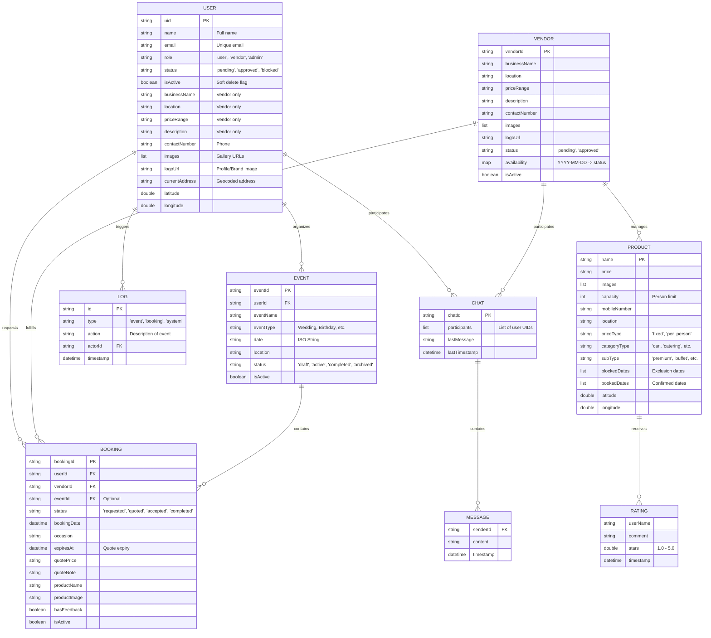

# 🌟 Event Management MVP - Stage 2

A premium, production-ready Event Management platform built with **Flutter** and **Firebase**. This stage introduces advanced lifecycles, stability controls, professional-scale features, and comprehensive documentation.

---

## 📖 Table of Contents
- [🚀 Tech Stack](#-tech-stack)
- [📊 System Architecture](#-system-architecture)
- [🎭 User Roles & Lifecycles](#-user-roles--lifecycles)
- [🏗️ Schema & Models](#️-schema--models)
- [✨ Design & Experience](#-design--experience)
- [⚙️ Development Setup](#️-development-setup)
- [📜 Project Documentation](#-project-documentation)

---

## 🚀 Tech Stack
- **Frontend**: Flutter (v3.9.2 sdk)
- **Backend**: Firebase (Authentication, Firestore, Storage)
- **State Management**: Provider (Clean Architecture approach)
- **Maps & Location**: FlutterMap + Nominatim Search API
- **Calendar**: Table Calendar (for Vendor Availability)
- **Media**: Image Picker + Firebase Storage

---

## 📊 System Architecture & Diagrams

### 1. Entity-Relationship (ER) Diagram
The following diagram illustrates the complete database schema, including all properties, data types, and complex relationships.

---

### 2. Data Flow Diagram (DFD)
This diagram details the flow of data through the Event Management system across all logical layers.

#### Level 1: Core Process Breakdown

---

## 🎭 User Roles & Lifecycles

### 👤 User (Organizer)
- **Enhanced Event Tracking**:
    - **Draft → Active → Completed → Archived**: Manage the full journey of an event.
    - **Status Badges**: Real-time visual indicators of event progress.
    - **Timeline View**: Separate 'Active' and 'Past' segments for clutter-free management.
- **Dynamic Booking Flow**:
    - **Request → Quote → Transact**: Request services and receive formal quotations.
    - **Quotation Review**: Accept or Reject vendor quotes with one-tap actions.
- **Smart Discovery**:
    - **Availability Awareness**: Only book vendors who are not "Blocked" on your event date.
- **Communication Controls**:
    - **Booking-Locked Chat**: Messaging only enables once a booking request is initiated.

### 🏪 Vendor (Service Provider)
- **Availability Management**:
    - **Calendar Control**: Integrated Table-Calendar to mark dates as 'Available' or 'Blocked'.
    - **Validation**: System automatically prevents booking requests on blocked dates.
- **Professional Quotation System**:
    - **Submit Quotes**: Send formal pricing and detailed notes to users.
    - **Quotation Immutability**: Once accepted, quotes are fixed to ensure trust.
- **Lifecycle Management**:
    - **Accepted → Completed**: Update booking status as the service is delivered.
    - **Automated Archive**: Completed bookings move to a dedicated history section.

### 🛡️ Admin (System Governance)
- **Global Audit Logs**:
    - **Real-time Feed**: A centralized stream of every status change, approval, and cancellation.
    - **Transparency**: Every action logs the Actor ID and precise timestamp.
- **Conflict & Error Resolution**:
    - **Manual Override**: Admins can force-update any booking status for dispute resolution.
- **Data Integrity**:
    - **Soft Delete System**: Implemented `isActive: false` across Users, Vendors, and Events to preserve audit trails.

---

## 🏗️ Schema & Models
- **EventModel**: Extended with `status` and `isActive` flags.
- **BookingModel**: Enhanced with `expiresAt`, `quotePrice`, `quoteNote`, and multi-stage status.
- **VendorModel**: Integrated `availability` map (Date string to status).
- **LogModel**: New schema for system-wide audit logging.
- **Audit Logging**: Integrated into all services (`UserService`, `VendorService`, `AdminService`).

---

## ✨ Design & Experience
- **Branding**: Consistent deep purple (#904CC1) accentuation throughout the app.
- **Micro-interactions**: Smooth transitions between dashboard tabs and custom floating notifications.
- **UI/UX Stability**: `PopScope` integration guards against accidental app exits.

---

## ⚙️ Development Setup
1.  **Dependencies**: Run `flutter pub get`.
2.  **Firebase**: Ensure `google-services.json` (Android) or `GoogleService-Info.plist` (iOS) is correctly placed.
3.  **Run**: Execute `flutter run`.

---
*Developed for Lifecycle, Stability & Scale.*

