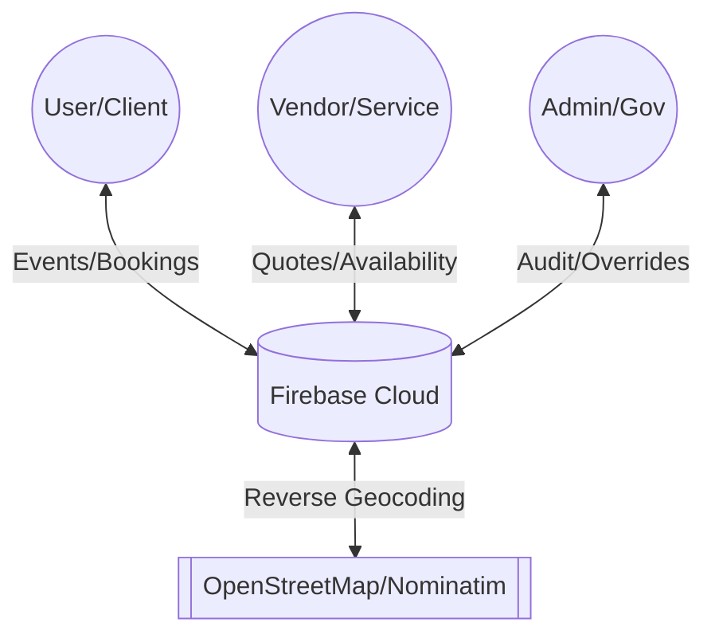
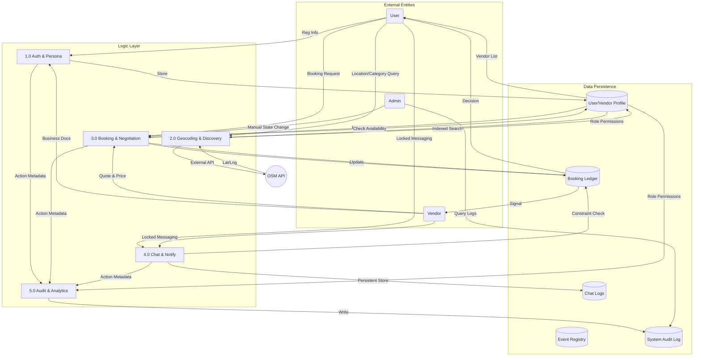

# Data Flow Diagram (DFD) - Process Logic & Details

This documentation details the flow of data through the Event Management system across all logical layers.

## Level 0: Global Context
The highest level of abstraction showing interactions with external entities.

---

## Level 1: Core Process Breakdown
A detailed look at the functional modules and data movement.

---

## Level 2: Detailed Process Logic

### 1.0 Authentication & Role Resolution
- **Input**: Email, Password, Social Auth.
- **Processing**: Firebase Auth verifies credentials. `auth_provider.dart` fetches Firestore document to determine if the user is a `user`, `vendor`, or `admin`.
- **Output**: Role-based routing (e.g., `UserHomeScreen` vs `VendorDashboard`).

### 2.0 Spatial Discovery (Vendor Search)
- **Input**: User's search term or current GPS.
- **Processing**: 
    1. `location_helper.dart` calls Nominatim (OpenStreetMap) for reverse geocoding.
    2. Coordinates are matched against `VendorModel.latitude/longitude`.
    3. Results filtered by `categoryType` and `availability`.
- **Data Flow**: `Map API` → `Search Service` → `UI List`.

### 3.0 Booking & Negotiation Protocol
- **The "Request" Flow**: 
    - User checks Date. System validates `VendorModel.availability[date] != 'blocked'`.
- **The "Quotation" Flow**:
    - Vendor receives request. Attaches `quotePrice`. 
    - Data flow: `UI` → `VendorService.submitQuote()` → `Booking Ledger`.
- **Completion Flow**:
    - Vendor marks `completed`. 
    - System triggers `LogModel` entry and updates `Event Registry` status.

### 4.0 Secure Communication (Chat)
- **Data Guard**: `ChatService` checks `Booking Ledger` before allowing message writes.
- **Persistence**: Messages stored in sub-collections.
- **Flow**: `Sender` → `Validation Logic` → `Firestore` → `StreamBuilder` → `Receiver`.

### 5.0 Audit Trailing (The Logger)
- **Trigger**: Every `update`, `delete`, or `statusChange`.
- **Execution**: Logic in `AdminService` and `LogProvider` creates a `LogModel` with `ActorID` and `Timestamp`. 
- **Privacy**: Only accessible by users with `role == 'admin'`.
