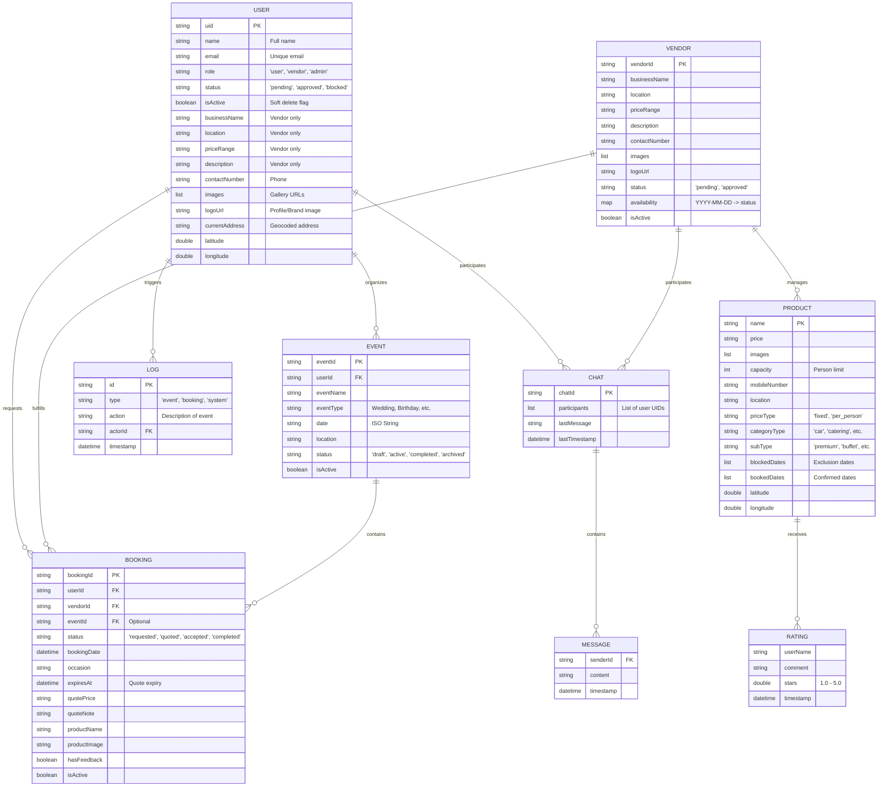

# Entity-Relationship (ER) Diagram - Complete Details

This diagram provides a comprehensive view of the database structure, including all properties, data types, and complex relationships.

## Detailed Data Structures

### 1. User/Vendor Hybrid Model
The platform uses a unified `UserModel` where roles are distinguished by the `role` field.
- **Users**: Focus on `uid`, `name`, `email`, and `role`.
- **Vendors**: Utilize extended fields like `businessName`, `products`, and `latitude/longitude`.

### 2. Product Architecture
Vendors don't just exist; they offer specific **Products** (Services).
- Each product maintains its own `blockedDates` and `bookedDates` to ensure no double-booking.
- Ratings are nested within products but aggregated at the Vendor level for `averageRating`.

### 3. Booking Lifecycle
The `BOOKING` entity is the most dynamic:
1. **Requested**: User sends a request for a Date + Occasion + Product.
2. **Quoted**: Vendor attaches `quotePrice` and `quoteNote`.
3. **Accepted/Completed**: Transitions based on user confirmation and service delivery.

### 4. Governance & Integrity
- **LogModel**: Captures every critical state change for audit trails.
- **isActive**: Every major entity supports soft-deletion to maintain database history while cleaning the user interface.
